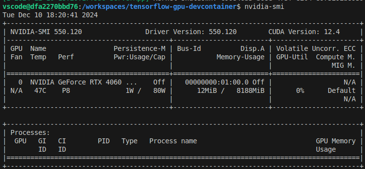
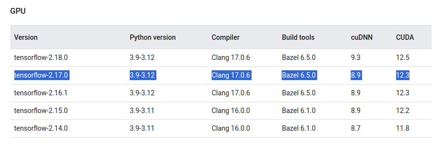

# TensorFlow Development Environment with DevContainer

This template provides a pre-configured development environment using DevContainer, based on an image with TensorFlow and Jupyter pre-installed. It is ideal for those looking to learn and experiment with deep learning projects that require GPU processing in a fully optimized setup.

## Environment Features

- Based on the `tensorflow/tensorflow:2.17.0-gpu-jupyter` image.
- GPU support enabled.
- Pre-configured non-root user (`vscode`) with `sudo` privileges.

## Verifying GPU Support with `nvidia-smi`

To ensure that GPU support is properly configured, you can verify the availability of your GPU using the `nvidia-smi` command. Follow these steps:

1. Open a terminal inside the DevContainer environment.
2. Run the following command:

   ```
   nvidia-smi
   ```

3. If GPU support is correctly configured, you should see a table displaying information about your NVIDIA GPU, including its model, memory usage, and other details.

<br>



## Testing the Environment with Jupyter Notebook

You can test the DevContainer environment by running the provided Jupyter Notebook file `test_devcontainer.ipynb`. This notebook contains a simple script to verify the functionality of TensorFlow and GPU support.

### Steps to Run the Notebook

1. Open the terminal inside the DevContainer environment.
2. Start the Jupyter Notebook server by running:

   ```
   jupyter notebook
   ```

3. Once the server starts, open the link provided in the terminal in your web browser.
4. Locate and open the [test_devcontainer.ipynb](./test_devcontainer.ipynb) file.
5. Run the cells in the notebook to validate that TensorFlow is installed correctly and can detect the GPU.

This notebook includes basic tests like checking TensorFlow's version and verifying GPU availability. It serves as a quick way to ensure your setup is ready for deep learning projects.

## Avoid Common Pitfalls
- **Do not manually upgrade TensorFlow** inside a preconfigured GPU Docker image.
- If you need a specific TensorFlow version, **always use an official Docker image** that ensures compatibility between TensorFlow, CUDA, and cuDNN.



### References
- [tensorflow-cuda compatibilty reference](https://www.tensorflow.org/install/source#gpu)
- [Tensorflow DockerHub](https://hub.docker.com/r/tensorflow/tensorflow/tags)